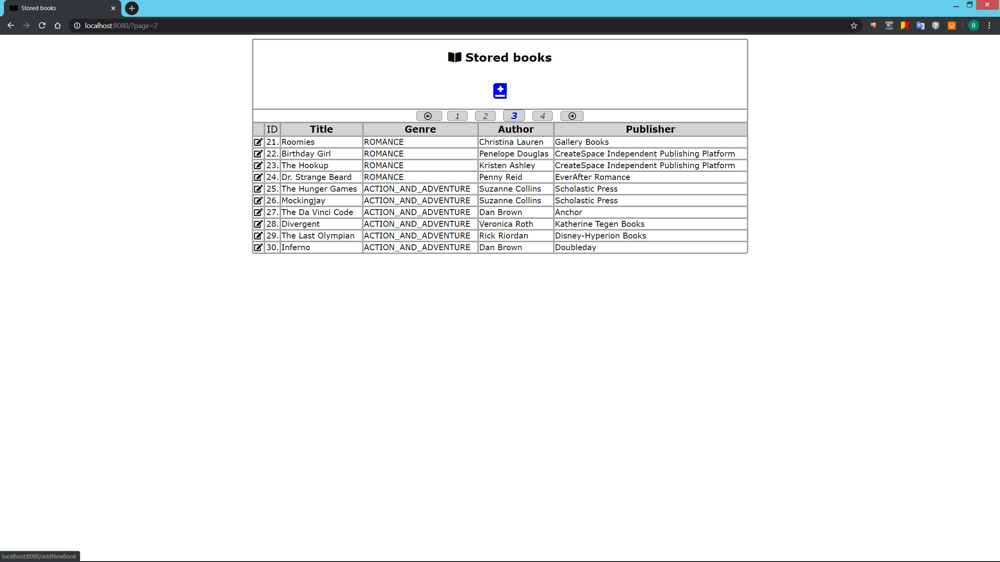
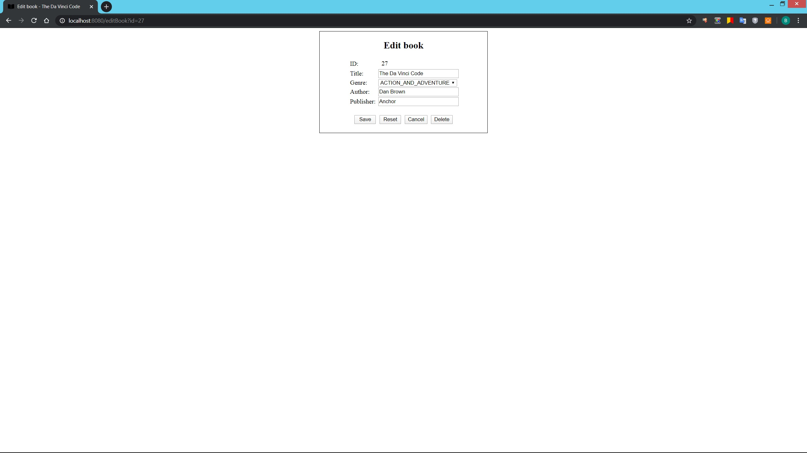

The BookStoreExample is a Java application with the Web interface, which emulates a simple book storage with add, remove and edit features. Uses local PostgreSQL database to store information about books.
Also available on DockerHub (vadimlofitsky/book-store-example).

